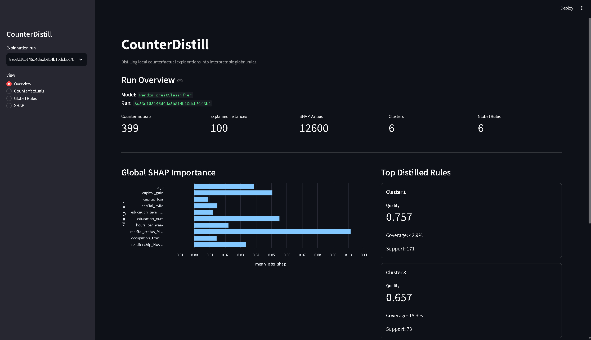
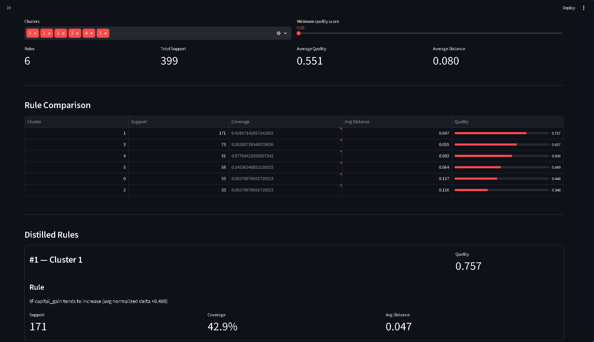
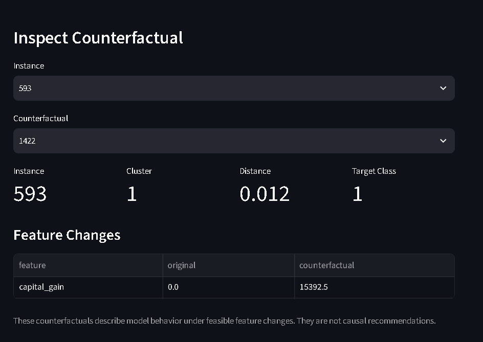
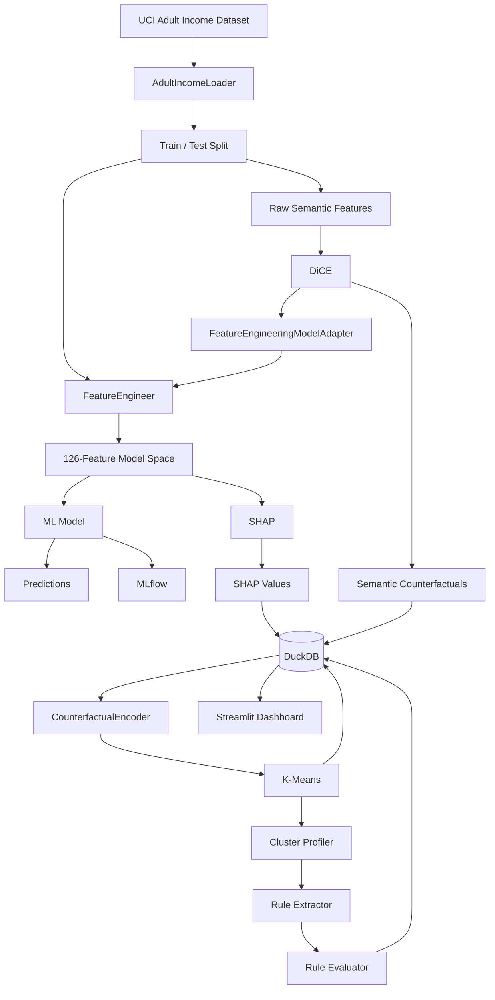
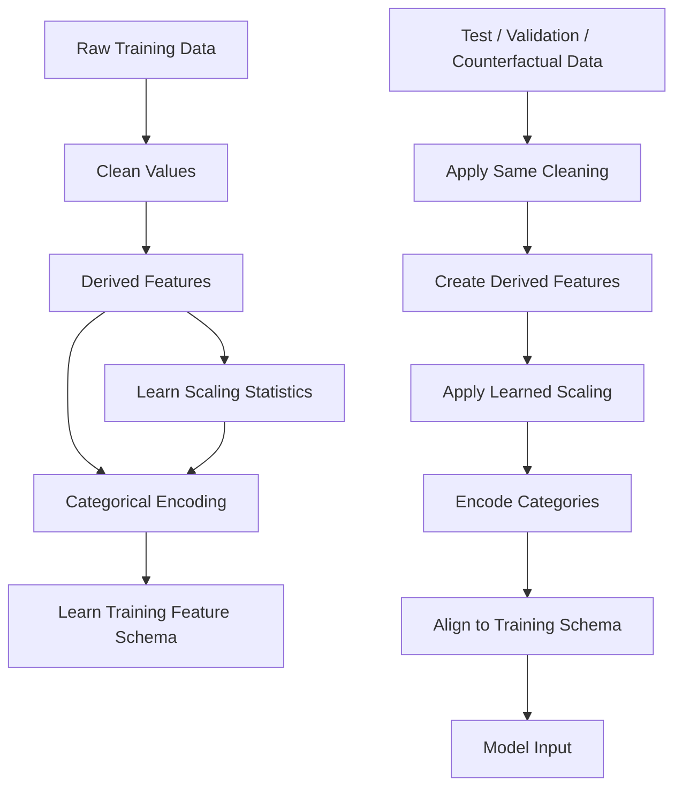
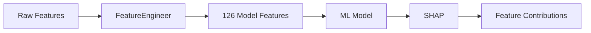
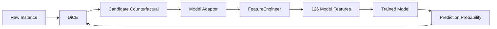

# CounterDistill

## Distilling Local Counterfactual Explanations into Global Interpretable Rules

**CounterDistill** is an end-to-end machine learning engineering and explainable AI project that investigates whether collections of local counterfactual explanations can be aggregated into concise, human-readable global patterns.

The project combines:

* **Polars** for train-aware feature engineering
* **scikit-learn**, **XGBoost**, and **LightGBM** for modeling
* **DiCE** for semantic counterfactual explanations
* **SHAP** for feature-attribution explanations
* **K-Means** for counterfactual intervention clustering
* custom global rule extraction and evaluation
* **DuckDB** for analytical persistence
* **MLflow** for experiment tracking and model artifacts
* **Optuna** for hyperparameter optimization
* **Hydra** for configuration management
* **Streamlit** for interactive exploration
* **Docker / Docker Compose** for reproducible execution
* **uv** for Python dependency management
* **pytest**, **Ruff**, and **mypy** for engineering quality

> Counterfactual explanations and distilled rules describe **model behavior**. They should not be interpreted as causal effects or real-world prescriptions.

---
# Demo

CounterDistill includes an interactive Streamlit dashboard for exploring local counterfactual explanations, SHAP feature attributions, counterfactual clusters, and the global rules distilled from them.

### Overview



The overview connects the complete explanation pipeline in one place: counterfactual coverage, SHAP feature importance, clustering results, and the highest-quality distilled rules.

### From 399 Local Explanations to 6 Global Rules



CounterDistill clusters semantically encoded counterfactual interventions and distills each cluster into a compact rule summarizing recurring model behavior.

### Inspect an Individual Counterfactual



The Counterfactual Explorer preserves explanations in the original semantic feature space, making it possible to inspect exactly which feasible changes alter an individual prediction.

---

# Project Motivation

Modern machine-learning models can make strong predictions while remaining difficult to understand.

Local explanation methods help answer questions about individual predictions:

* **SHAP** estimates how individual features influenced a model prediction.
* **Counterfactual explanations** ask what feasible feature changes could alter that prediction.

For example:

```text
Original prediction: <= $50K

Possible counterfactual changes:
    education: HS-grad -> Bachelors
    occupation: Tech-support -> Exec-managerial
    capital_gain: 0 -> 5000

Counterfactual prediction: > $50K
```

A single explanation can be useful, but hundreds of explanations quickly become difficult to inspect manually.

CounterDistill asks a larger question:

> **Can recurring intervention patterns across many local counterfactual explanations be distilled into global explanations of model behavior?**

The project therefore moves beyond generating explanations and builds a complete pipeline for:

```text
Local Counterfactuals
        ↓
Semantic Change Encoding
        ↓
Counterfactual Clustering
        ↓
Cluster Profiling
        ↓
Global Rule Extraction
        ↓
Rule Quality Evaluation
        ↓
Interactive Exploration
```

---

# Results — v1.0

CounterDistill's v1.0 evaluation uses a **single canonical Random Forest run** for model performance, SHAP explanations, DiCE counterfactuals, clustering, and rule distillation.

```text
MLflow / Explanation Run
8e53d165146d4da5b814b10dcb5143b2
```

This keeps the reported model metrics and explanation artifacts tied to the same trained model.

## Model Performance

| Metric            |     Result |
| ----------------- | ---------: |
| **Test Accuracy** | **86.69%** |
| **F1 Score**      | **0.6957** |
| **ROC AUC**       | **0.9201** |
| Encoded Features  |        126 |
| Training Rows     |     26,048 |
| Test Rows         |      6,513 |

The final Random Forest achieves an ROC AUC of **0.9201**, indicating strong separation between the two Adult Income classes while maintaining a fully reproducible 126-feature preprocessing pipeline.

## Explainability Coverage

| Metric                                    |     Result |
| ----------------------------------------- | ---------: |
| Sampled Instances                         |        100 |
| Instances with Valid Counterfactuals      |     **96** |
| Counterfactual Coverage                   |  **96.0%** |
| Generated Counterfactuals                 |    **399** |
| Mean Counterfactuals per Covered Instance |       4.16 |
| Mean Counterfactual Distance              | **0.0653** |
| Mean Changed Features                     |   **1.63** |
| Unique Intervention Signatures            |         15 |
| Stored SHAP Values                        |     12,600 |

CounterDistill found at least one feasible counterfactual for **96 of 100 sampled test instances**.

The average counterfactual changed only **1.63 semantic features**, with a mean normalized distance of **0.0653**. This suggests that the generated explanations typically reach a different prediction using relatively small interventions rather than broad changes across many features.

## Counterfactual Distillation

| Metric                   |     Result |
| ------------------------ | ---------: |
| Counterfactual Clusters  |      **6** |
| Silhouette Score         | **0.4142** |
| Global Rules             |      **6** |
| Mean Rule Quality        | **0.5509** |
| Best Rule Quality        | **0.7573** |
| Mean Conditions per Rule |   **2.17** |
| Mean Rule Similarity     |     0.1524 |
| Maximum Rule Similarity  |     0.5000 |

The six-cluster intervention representation reaches a silhouette score of **0.4142**, improving separation between recurring counterfactual patterns compared with the earlier pipeline.

The distilled rules remain compact at an average of **2.17 conditions per rule**, while the relatively low mean pairwise Jaccard similarity of **0.1524** indicates that the rule set captures meaningfully different intervention patterns rather than repeatedly describing the same behavior.

## What the Model Relies On

The strongest global SHAP signals for the final model are:

| Rank | Feature                             | Mean Absolute SHAP |
| ---: | ----------------------------------- | -----------------: |
|    1 | `marital_status_Married-civ-spouse` |           0.101542 |
|    2 | `education_num`                     |           0.055308 |
|    3 | `capital_gain`                      |           0.050649 |
|    4 | `age`                               |           0.038674 |
|    5 | `relationship_Husband`              |           0.033725 |
|    6 | `hours_per_week`                    |           0.022203 |
|    7 | `capital_ratio`                     |           0.014912 |
|    8 | `occupation_Exec-managerial`        |           0.014505 |

SHAP answers **which encoded features influence model predictions**, while the counterfactual distillation layer answers a different question:

> **What recurring semantic changes tend to move predictions across the model's decision boundary?**

That distinction is central to CounterDistill.

## Distilled Counterfactual Archetypes

The final six clusters expose several recurring model intervention patterns:

| Cluster |          Support |    Quality | Dominant Pattern                                |
| ------: | ---------------: | ---------: | ----------------------------------------------- |
|   **1** | **171 (42.86%)** | **0.7573** | Increase `capital_gain`                         |
|   **3** |      73 (18.30%) |     0.6568 | Decrease `hours_per_week`                       |
|   **4** |       31 (7.77%) |     0.6061 | Increase `capital_loss`                         |
|   **5** |      58 (14.54%) |     0.4889 | Increase both `capital_gain` and `capital_loss` |
|   **0** |       33 (8.27%) |     0.4480 | Increase `capital_gain` + change occupation     |
|   **2** |       33 (8.27%) |     0.3482 | Increase `capital_gain` + change workclass      |

### Highest-quality distilled rule

The strongest global rule is also the largest cluster:

```text
Cluster 1
Support: 171 counterfactuals (42.86%)
Quality score: 0.7573
Average distance: 0.0472

Rule:
capital_gain tends to increase
```

This does **not** mean increasing capital gain causes higher income in the real world.

It means that, among the feasible counterfactuals produced for this model and dataset, increasing `capital_gain` is the most common low-distance intervention associated with crossing the model's prediction boundary.

## Key Takeaways

**1. Counterfactual generation is broadly successful.**
Valid semantic counterfactuals were generated for **96%** of the shared explanation sample.

**2. Most counterfactuals are compact.**
Only **1.63 features change on average**, supporting the goal of producing understandable local interventions.

**3. Counterfactual behavior has measurable structure.**
The final intervention representation reaches a **0.4142 silhouette score**, showing that recurring counterfactual strategies form distinguishable groups.

**4. Distillation compresses hundreds of explanations into six global patterns.**
The pipeline reduces **399 local counterfactuals to 6 interpretable rules**.

**5. SHAP and counterfactual distillation reveal complementary behavior.**
Features such as marital status and education dominate global SHAP importance, while the counterfactual clusters emphasize actionable intervention patterns involving capital gain, working hours, occupation, workclass, and capital loss.

> **Interpretation note:** CounterDistill explains the behavior of a trained predictive model under hypothetical feature changes. Counterfactuals and distilled rules are descriptive model explanations, not causal conclusions or real-world recommendations.

---

# System Architecture



---

# Feature Engineering

CounterDistill uses a train-aware Polars feature-engineering pipeline.



Derived features include:

| Feature           | Description                              |
| ----------------- | ---------------------------------------- |
| `age_group`       | bucketed age representation              |
| `hours_category`  | grouped weekly working hours             |
| `education_level` | grouped education level                  |
| `capital_ratio`   | derived capital gain/loss representation |

The current pipeline produces **126 model features**.

Feature engineering follows:

```python
engine = FeatureEngineer(
    x_train,
    config=cfg.feature_engineering,
)

x_train_fe = engine.fit_transform()
x_test_fe = engine.transform(x_test)
```

Only the training data is used to learn preprocessing statistics and the encoded feature schema.

This prevents test-set leakage while ensuring that training, validation, test, SHAP, and counterfactual model inputs remain compatible.

---

# Model Training

Training is configured through Hydra.

Example Random Forest configuration:

```yaml
_class_: sklearn.ensemble.RandomForestClassifier
n_estimators: 100
max_depth: 10
min_samples_split: 5
min_samples_leaf: 2
random_state: 42
n_jobs: -1
```

Run training with:

```bash
uv run python -m src.modeling.train model=random_forest
```

The training workflow logs:

* model parameters
* data parameters
* accuracy
* classification metrics
* feature count
* feature importance
* preprocessing schema
* resolved Hydra configuration
* trained model artifact

to MLflow.

---

# MLflow Experiment Tracking

The default local tracking backend is:

```text
sqlite:///database/mlflow.db
```

Start the MLflow server with:

```bash
uv run mlflow server \
    --backend-store-uri sqlite:///database/mlflow.db \
    --host 127.0.0.1 \
    --port 5000 \
    --workers 1
```

Then open:

```text
http://localhost:5000
```

MLflow is used for training and hyperparameter optimization.

DuckDB is used separately for explainability and distillation artifacts.

These systems intentionally serve different purposes:

```text
MLflow
├── experiment parameters
├── training metrics
├── tuning trials
├── model artifacts
└── preprocessing artifacts

DuckDB
├── counterfactuals
├── SHAP values
├── cluster assignments
├── global rules
└── explainability provenance
```

CounterDistill's semantic explanation `run_id` values are project-level identifiers and should not be assumed to be identical to MLflow run IDs.

---

# Hyperparameter Optimization

Optuna is integrated with MLflow for model tuning.

The tuning architecture uses one parent MLflow run for the study and nested child runs for individual trials:

```text
Optuna Study / MLflow Parent
│
├── trial-000
│   ├── sampled parameters
│   └── validation metrics
│
├── trial-001
│
├── trial-002
│
└── ...
        ↓
    Best Trial
        ↓
Retrain on Full Training Split
        ↓
Evaluate on Held-Out Test Set
        ↓
Log Final Model
```

Run a tuning study with:

```bash
uv run python -m src.modeling.tune \
    model=random_forest
```

For a shorter smoke test:

```bash
uv run python -m src.modeling.tune \
    model=random_forest \
    optuna.n_trials=5 \
    optuna.timeout=300
```

Optuna validation data is kept separate from the final held-out test set.

Feature engineering is fitted only on the tuning subset during optimization. After the best hyperparameters are selected, preprocessing and the model are refitted using the complete training split before final test evaluation.

---

# Explainability

CounterDistill deliberately operates SHAP and DiCE at different levels of the pipeline.

## SHAP

SHAP explains the exact encoded model representation.



For 100 explained instances:

```text
100 instances × 126 features
= 12,600 stored SHAP values
```

Global SHAP importance can then be computed directly from DuckDB.

---

## DiCE

DiCE operates in the original semantic feature space.



This preserves explanations such as:

```json
{
  "education": "Bachelors",
  "occupation": "Exec-managerial",
  "hours_per_week": 45,
  "capital_gain": 5000
}
```

instead of exposing changes to anonymous one-hot model columns.

### Counterfactual feasibility

The current semantic counterfactual pipeline constrains generated explanations to improve interpretability.

Examples include:

* immutable sensitive attributes are not varied
* dependent education fields remain consistent
* education cannot decrease
* invalid or unknown occupation/workclass destinations are rejected
* selected numerical and categorical features define the actionable search space

---

# Counterfactual Distillation

The central contribution of CounterDistill is the aggregation layer.

## 1. Intervention Encoding

`CounterfactualEncoder` represents **what changed**, rather than clustering people based on their original attributes.

Numerical interventions are encoded using:

```text
normalized signed delta
+
changed indicator
```

Categorical interventions are encoded using:

```text
changed indicator
+
source → destination transition
```

Example:

```text
education:
HS-grad → Bachelors

occupation:
Tech-support → Exec-managerial

capital_gain:
0 → 5000
```

becomes a numerical intervention vector suitable for clustering.

---

## 2. Counterfactual Clustering

Encoded interventions are clustered using K-Means.

The currently selected configuration uses:

```yaml
n_clusters: 6
random_state: 42
n_init: 10
```

The validated six-cluster solution produces a silhouette score of approximately:

```text
0.3726
```

---

## 3. Cluster Profiling

Each cluster is summarized using:

* cluster size
* corpus share
* average counterfactual distance
* feature change rates
* normalized numeric deltas
* dominant categorical transitions

This turns numerical clusters into interpretable intervention archetypes.

---

## 4. Global Rule Extraction

Cluster profiles are transformed into human-readable rules.

Example patterns include:

```text
capital_gain tends to increase

education changes
AND HS-grad → Bachelors

capital_gain changes
AND occupation changes

hours_per_week tends to decrease
AND capital_gain changes
```

These rules summarize recurring model counterfactual behavior.

They are **descriptive rather than causal**.

---

## 5. Rule Evaluation

Distilled rules are evaluated using three components:

```text
40% coverage
30% compactness
30% counterfactual proximity
```

Higher-quality rules therefore:

* explain a larger fraction of counterfactuals
* remain concise
* are based on relatively close counterfactuals

Pairwise Jaccard similarity is also available for comparing rule redundancy.

---

# DuckDB Persistence

CounterDistill stores explainability artifacts in:

```text
database/counterdistill.db
```

Important tables include:

```text
counterfactuals
shap_values
metrics
explanations
counterfactual_clusters
global_rules
```

The persistence layer keeps model and run provenance alongside explanation artifacts.

Counterfactuals are stored using semantic JSON, allowing later analysis without reconstructing the model's one-hot representation.

Example:

```json
{
  "age": 39,
  "workclass": "Private",
  "education": "Bachelors",
  "occupation": "Tech-support",
  "hours_per_week": 40
}
```

---

# Streamlit Dashboard

CounterDistill includes an interactive dashboard for inspecting persisted explanation artifacts.

Start it locally with:

```bash
uv run streamlit run app/app.py
```

The dashboard currently provides four views.

## Overview

Displays:

* counterfactual count
* explained instances
* SHAP value count
* counterfactual clusters
* global rules
* global SHAP importance
* top distilled rules

## Counterfactual Explorer

Supports:

* cluster filtering
* counterfactual-distance filtering
* instance selection
* individual counterfactual inspection
* semantic feature-change comparison

## Global Rules

Supports:

* rule ranking
* quality filtering
* coverage comparison
* support comparison
* average counterfactual distance
* human-readable rule cards

## SHAP Explorer

Supports:

* global mean absolute SHAP importance
* instance-level explanations
* positive and negative feature contributions
* local feature tables

---

# Docker

Docker files are kept under:

```text
docker/
├── Dockerfile
├── Dockerfile.dockerignore
└── docker-compose.yml
```

The same project image supports training, tuning, explainability, aggregation, MLflow, and the Streamlit dashboard.

## Build

From the repository root:

```bash
docker compose \
    -f docker/docker-compose.yml \
    build
```

## Start MLflow and Streamlit

```bash
docker compose \
    -f docker/docker-compose.yml \
    up mlflow dashboard
```

Services are exposed at:

```text
MLflow:    http://localhost:5000
Dashboard: http://localhost:8501
```

## Train inside Docker

```bash
docker compose \
    -f docker/docker-compose.yml \
    run --rm counterdistill \
    python -m src.modeling.train \
    model=random_forest
```

## Run Optuna inside Docker

```bash
docker compose \
    -f docker/docker-compose.yml \
    run --rm counterdistill \
    python -m src.modeling.tune \
    model=random_forest \
    optuna.n_trials=5
```

## Generate explanations

```bash
docker compose \
    -f docker/docker-compose.yml \
    run --rm counterdistill \
    python -m src.explainability.explain \
    model=random_forest
```

## Run counterfactual aggregation

```bash
docker compose \
    -f docker/docker-compose.yml \
    run --rm counterdistill \
    python -m src.aggregation.aggregate
```

---

# Local Development

## Requirements

* Python 3.12+
* uv
* Git
* Docker Desktop / Docker Compose for containerized execution

Clone the repository:

```bash
git clone https://github.com/rodrick-mpofu/counterdistill.git
cd counterdistill
```

Install dependencies:

```bash
uv sync --dev
```

---

# Reproducing the Pipeline

A complete local workflow is:

## 1. Train

```bash
uv run python -m src.modeling.train \
    model=random_forest
```

## 2. Tune

Optional:

```bash
uv run python -m src.modeling.tune \
    model=random_forest
```

## 3. Generate explanations

```bash
uv run python -m src.explainability.explain \
    model=random_forest
```

## 4. Aggregate counterfactuals

```bash
uv run python -m src.aggregation.aggregate
```

## 5. Explore results

```bash
uv run streamlit run app/app.py
```

## 6. Inspect MLflow

```bash
uv run mlflow server \
    --backend-store-uri sqlite:///database/mlflow.db \
    --host 127.0.0.1 \
    --port 5000 \
    --workers 1
```

---

# Testing and Code Quality

Run the test suite:

```bash
uv run pytest
```

Run Ruff:

```bash
uv run ruff check src/ tests/
```

Verify formatting:

```bash
uv run ruff format --check src/ tests/
```

Run static type checking:

```bash
uv run mypy src/
```

The test suite includes coverage for:

* dashboard data access
* counterfactual intervention encoding
* K-Means clustering
* rule extraction and scoring
* Optuna search spaces
* model construction
* classifier evaluation
* tuning utility behavior

---

# Project Structure

```text
counterdistill/
│
├── app/
│   └── app.py
│
├── configs/
│   ├── config.yaml
│   ├── clustering/
│   ├── data/
│   ├── feature_engineering/
│   ├── mlflow/
│   ├── model/
│   └── optuna/
│
├── data/
│
├── database/
│   ├── counterdistill.db
│   └── mlflow.db
│
├── docker/
│   ├── Dockerfile
│   ├── Dockerfile.dockerignore
│   └── docker-compose.yml
│
├── src/
│   ├── aggregation/
│   │   └── aggregate.py
│   │
│   ├── clustering/
│   │   ├── kmeans.py
│   │   └── profiler.py
│   │
│   ├── dashboard/
│   │   ├── app.py
│   │   └── data.py
│   │
│   ├── explainability/
│   │   ├── dice.py
│   │   ├── encoder.py
│   │   ├── explain.py
│   │   └── shap.py
│   │
│   ├── features/
│   │   └── feature_engineering.py
│   │
│   ├── ingestion/
│   │   └── data_loader.py
│   │
│   ├── modeling/
│   │   ├── train.py
│   │   └── tune.py
│   │
│   ├── rules/
│   │   ├── evaluator.py
│   │   └── extractor.py
│   │
│   └── storage/
│       └── duckdb.py
│
├── tests/
│   ├── test_counterfactual_pipeline.py
│   ├── test_dashboard_data.py
│   └── test_tuning.py
│
├── pyproject.toml
├── uv.lock
└── README.md
```

---

# Technology Stack

| Area                        | Technology                      |
| --------------------------- | ------------------------------- |
| Language                    | Python                          |
| Data processing             | Polars                          |
| Machine learning            | scikit-learn, XGBoost, LightGBM |
| Counterfactual explanations | DiCE                            |
| Feature attribution         | SHAP                            |
| Counterfactual clustering   | K-Means                         |
| Configuration               | Hydra, OmegaConf                |
| Optimization                | Optuna                          |
| Experiment tracking         | MLflow                          |
| Analytical storage          | DuckDB                          |
| Dashboard                   | Streamlit                       |
| Package management          | uv                              |
| Containers                  | Docker, Docker Compose          |
| Testing                     | pytest                          |
| Linting / formatting        | Ruff                            |
| Type checking               | mypy                            |

---

# Implementation Status

| Component                            | Status        |
| ------------------------------------ | ------------- |
| Adult Income ingestion               | ✅ Implemented |
| Polars preprocessing                 | ✅ Implemented |
| Train-only feature fitting           | ✅ Implemented |
| 126-feature schema alignment         | ✅ Implemented |
| Random Forest training               | ✅ Implemented |
| XGBoost / LightGBM configuration     | ✅ Implemented |
| MLflow tracking                      | ✅ Implemented |
| Optuna optimization                  | ✅ Implemented |
| Nested MLflow Optuna trials          | ✅ Implemented |
| DiCE semantic model adapter          | ✅ Implemented |
| Feasible counterfactual generation   | ✅ Implemented |
| SHAP explanations                    | ✅ Implemented |
| DuckDB persistence                   | ✅ Implemented |
| Counterfactual intervention encoding | ✅ Implemented |
| Counterfactual clustering            | ✅ Implemented |
| Cluster profiling                    | ✅ Implemented |
| Global rule extraction               | ✅ Implemented |
| Rule quality evaluation              | ✅ Implemented |
| Streamlit dashboard                  | ✅ Implemented |
| pytest coverage                      | ✅ Implemented |
| Ruff / mypy quality checks           | ✅ Implemented |
| Docker runtime                       | ✅ Implemented |
| Docker Compose services              | ✅ Implemented |

---

# Design Principles

### Interpretability first

Counterfactuals remain in semantic feature space instead of being presented as changes to one-hot encoded model columns.

### No preprocessing leakage

Feature schemas and scaling statistics are learned using training data only.

### Separate model and explanation representations

SHAP explains the exact model feature space, while DiCE generates human-readable explanations in the original feature space.

### Distill interventions, not people

CounterDistill clusters **feature-change patterns**, not demographic groups or original observations.

### Reproducible experiments

Hydra, MLflow, Optuna, fixed seeds, `uv.lock`, and Docker make model experiments reproducible.

### Queryable explanations

DuckDB makes counterfactual, SHAP, cluster, and rule artifacts available for analytical queries.

### Local explanations should produce global insight

The project treats local counterfactual generation as the starting point rather than the final output.

---

# Limitations and Future Work

CounterDistill currently demonstrates the approach on the Adult Income dataset and binary classification.

Potential extensions include:

* evaluating additional datasets and domains
* comparing clustering algorithms
* comparing rule-extraction strategies
* measuring stability of distilled rules across seeds and models
* evaluating counterfactual fairness
* adding model-to-model rule comparisons
* experimenting with interpretable surrogate models
* adding richer experiment comparison to the dashboard
* deploying the dashboard and MLflow services to a remote environment

---

# Disclaimer

Counterfactual explanations answer questions about **model prediction behavior under hypothetical feature changes**.

They do not establish that making those changes in the real world would cause the predicted outcome.

The distilled rules in CounterDistill should therefore be interpreted as summaries of model behavior rather than causal, normative, or prescriptive recommendations.
