# CounterDistill

## From Local Counterfactual Explanations to Global Interpretability

**CounterDistill** is an end-to-end machine learning engineering and explainable AI project that explores how local counterfactual explanations can be aggregated and distilled into more global, human-readable patterns.

The project combines:

* configurable feature engineering with **Polars**
* model training with **scikit-learn**, **XGBoost**, and **LightGBM**
* experiment tracking with **MLflow**
* hyperparameter optimization with **Optuna**
* local explanations with **DiCE** and **SHAP**
* analytical storage with **DuckDB**
* configuration management with **Hydra**
* reproducible environments with **uv**
* containerization with **Docker**
* a future global distillation layer based on counterfactual aggregation and interpretable models

> **Current status:** the supervised training, train-aware feature engineering, DiCE counterfactual generation, SHAP explanation pipeline, MLflow integration, and DuckDB persistence are implemented. The counterfactual aggregation/distillation and dashboard layers are the next major stages.

---

## Why CounterDistill?

Modern machine learning models can be accurate while remaining difficult to interpret.

Local explanation methods help explain individual predictions:

* **SHAP** estimates how strongly each model feature contributed to a prediction.
* **Counterfactual explanations** answer a more actionable question:

> *What would need to change for the model to make a different prediction?*

A local counterfactual might say:

```text
Original prediction: <= $50K

Change:
    occupation: Tech-support -> Exec-managerial
    hours_per_week: 40 -> 47

Counterfactual prediction: > $50K
```

That is useful for one instance, but a dataset may contain hundreds or thousands of these explanations.

CounterDistill asks a larger question:

> **Can many local counterfactual explanations be aggregated into concise global explanations of model behavior?**

The long-term goal is to transform a large collection of local explanations into patterns such as:

```text
Cluster A
--------
Higher-income predictions are frequently reached through:
- increased working hours
- higher education levels
- movement toward managerial occupations

Cluster B
--------
For younger individuals, education-related changes dominate
the model's counterfactual decision paths.
```

---

# System Overview

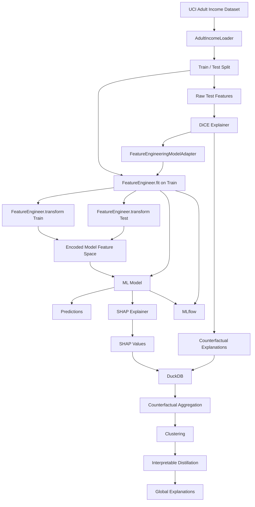

---

# Explainability Architecture

SHAP and DiCE operate at **different levels of the pipeline**.

This distinction is important.

## SHAP

SHAP explains the exact encoded representation consumed by the trained model.

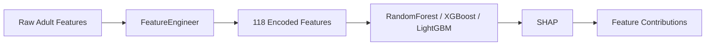

For the current Random Forest pipeline, SHAP operates on the **118-feature model representation**.

Example output:

```text
instance_id | feature_name                  | shap_value
------------|-------------------------------|-----------
0           | age                           | 0.031
0           | occupation_Exec-managerial    | 0.087
0           | capital_gain                  | 0.194
...
```

---

## DiCE

DiCE operates in the **original semantic feature space** so counterfactuals remain understandable.

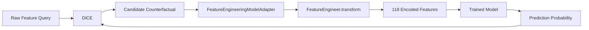

Instead of producing a counterfactual such as:

```text
occupation_Tech-support = 0
occupation_Exec-managerial = 1
age_group_young_adult = 0
...
```

CounterDistill preserves explanations like:

```json
{
  "age": 37,
  "education": "Masters",
  "occupation": "Exec-managerial",
  "hours_per_week": 45
}
```

This representation is much more useful for downstream distillation.

---

# Feature Engineering Pipeline

The feature engineering layer uses **Polars** and follows a train-aware `fit` / `transform` workflow.

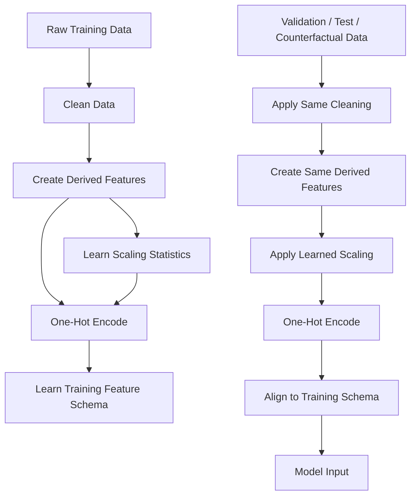

### Derived features

The current pipeline creates:

| Feature           | Description                        |
| ----------------- | ---------------------------------- |
| `age_group`       | Bucketed representation of age     |
| `hours_category`  | Working-hours category             |
| `education_level` | Grouped education level            |
| `capital_ratio`   | Relative capital gain/loss feature |

Categorical columns are one-hot encoded using Polars.

The current Random Forest pipeline produces **118 model features**.

### Why `fit()` / `transform()` matters

A previous implementation concatenated train and test data before one-hot encoding to guarantee matching columns.

CounterDistill now learns the feature schema on **training data only**:

```python
engine = FeatureEngineer(
    x_train,
    config=cfg.feature_engineering,
)

x_train_fe = engine.fit_transform()
x_test_fe = engine.transform(x_test)
```

This prevents test-set information from leaking into preprocessing while still guaranteeing identical model columns.

---

# Training Pipeline

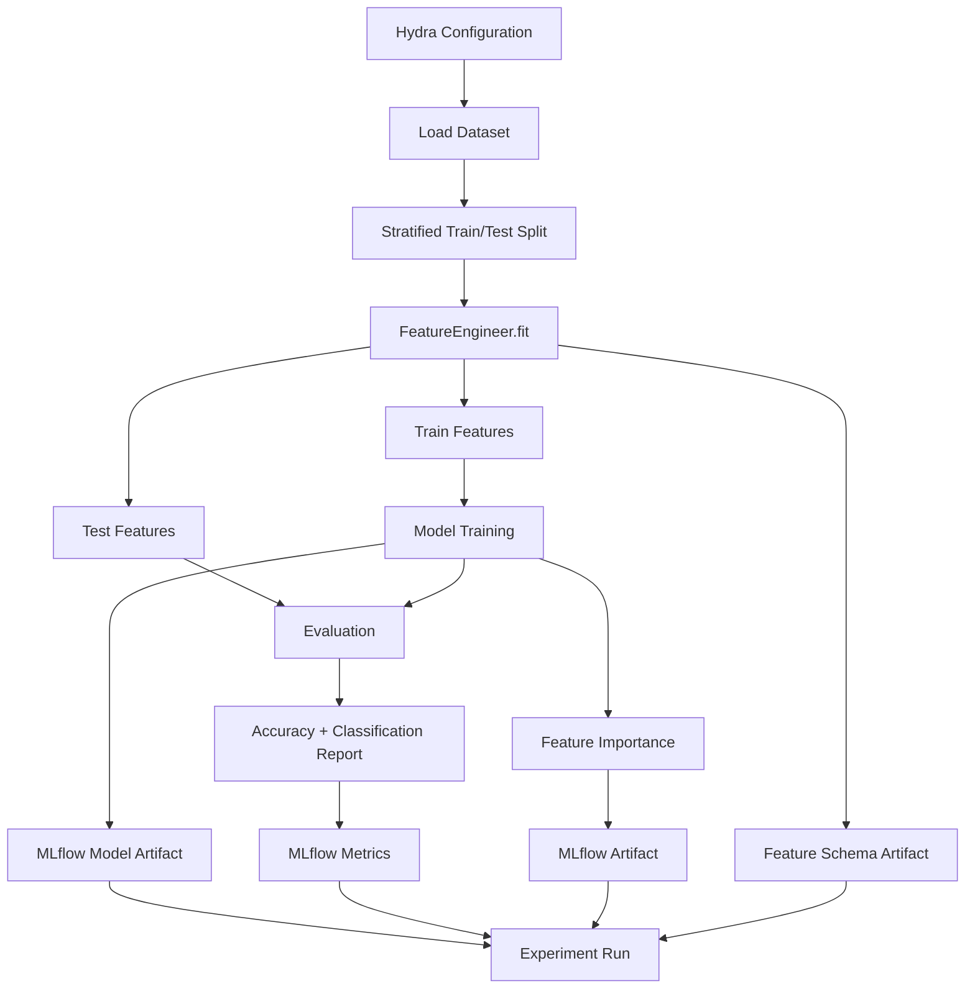

Models are configured through Hydra.

Example:

```yaml
_class_: sklearn.ensemble.RandomForestClassifier
n_estimators: 100
max_depth: 10
min_samples_split: 5
min_samples_leaf: 2
random_state: 42
n_jobs: -1
```

Run a Random Forest experiment with:

```bash
uv run python -m src.modeling.train model=random_forest
```

Hydra makes it possible to switch model configurations without rewriting training code.

---

# Explainability Pipeline

Run:

```bash
uv run python -m src.explainability.explain model=random_forest
```

The pipeline:

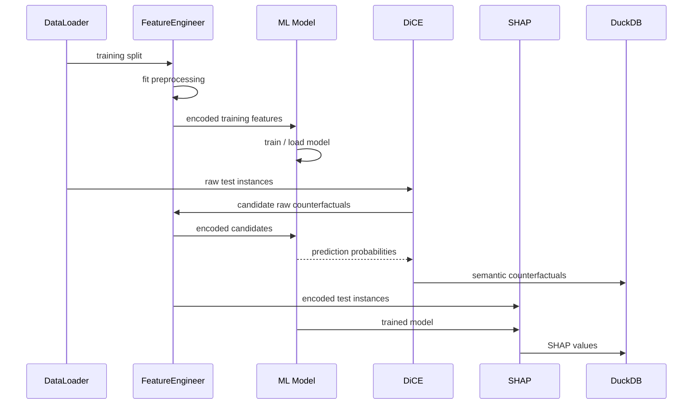

A successful local run currently produces results on the order of:

```text
FeatureEngineer fitted on 26,048 training rows
118 encoded model features

DiCE:
~500 counterfactual explanations for 100 sampled instances

SHAP:
100 instances x 118 features
= 11,800 SHAP records
```

Exact results depend on the configured model, seed, and counterfactual search behavior.

---

# Counterfactual Distillation

The main research/engineering goal of the project begins after counterfactual generation.

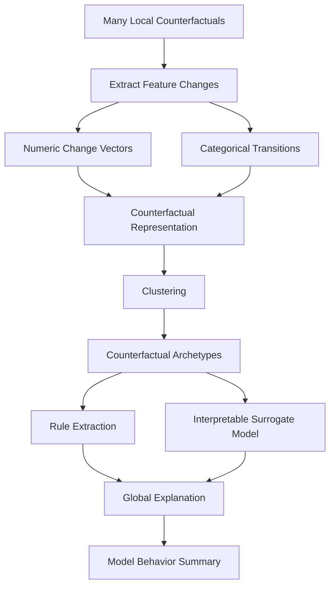

Potential distilled outputs include:

* common feature-change patterns
* counterfactual archetypes
* cluster-level explanations
* decision rules
* small decision trees
* feature transition matrices
* global summaries of what tends to flip predictions

This layer is intentionally separated from the model explanation layer so multiple explanation and clustering strategies can be compared.

---

# Data Storage with DuckDB

CounterDistill uses **DuckDB** as a lightweight analytical database.

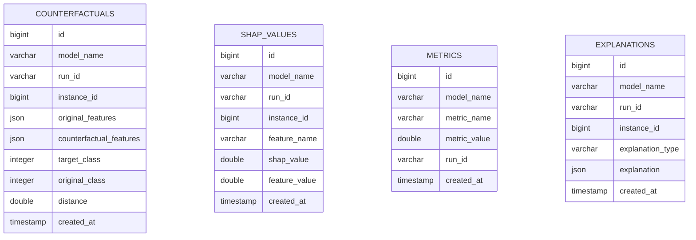

Counterfactuals are stored using semantic JSON rather than anonymous encoded vectors.

Example:

```json
{
  "age": 39,
  "workclass": "Private",
  "education": "Bachelors",
  "occupation": "Tech-support",
  "hours_per_week": 40
}
```

The `run_id` field connects explanation artifacts to the MLflow model run that produced them.

Default database location:

```text
database/counterdistill.db
```

---

# MLflow Experiment Tracking

MLflow tracks:

* model parameters
* evaluation metrics
* trained model artifacts
* classification metrics
* feature importance
* preprocessing feature schema
* experiment/run metadata

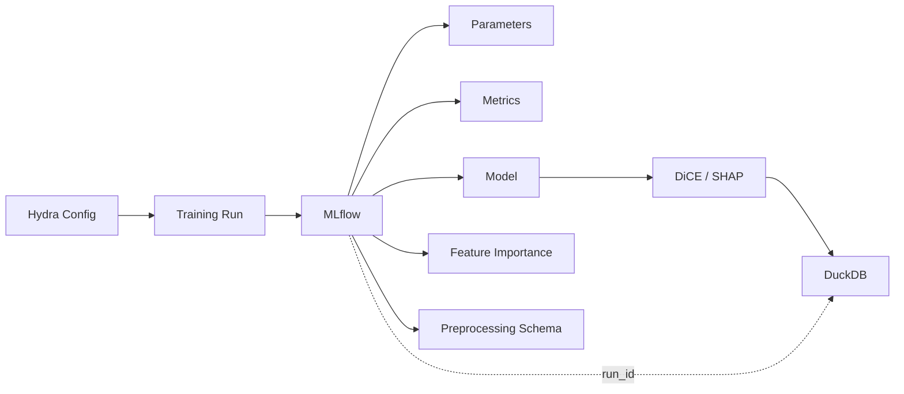

This makes explanations reproducible against a specific trained model.

---

# Hydra Configuration

Configuration is organized under `configs/`.

```text
configs/
├── config.yaml
├── data/
│   └── adult_income.yaml
├── feature_engineering/
│   └── default.yaml
├── model/
│   └── random_forest.yaml
├── clustering/
│   └── ...
├── mlflow/
│   └── default.yaml
└── optuna/
    └── default.yaml
```

The global configuration currently controls values such as:

```yaml
seed: 42
device: cpu

batch_size: 1000
num_counterfactuals: 100
counterfactual_encoding: standard

data_dir: data
database_dir: database
output_dir: outputs
```

Hydra overrides can be supplied from the CLI:

```bash
uv run python -m src.modeling.train \
    model=random_forest \
    seed=123
```

---

# Optuna

Optuna is included for automated hyperparameter optimization.

Conceptually:

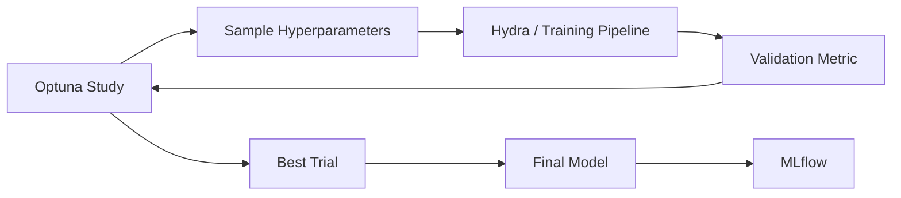

The optimization layer is intended to compare model configurations while keeping preprocessing and experiment tracking reproducible.

---

# Docker Architecture

Docker provides a reproducible runtime for the project.

The recommended container layout is:

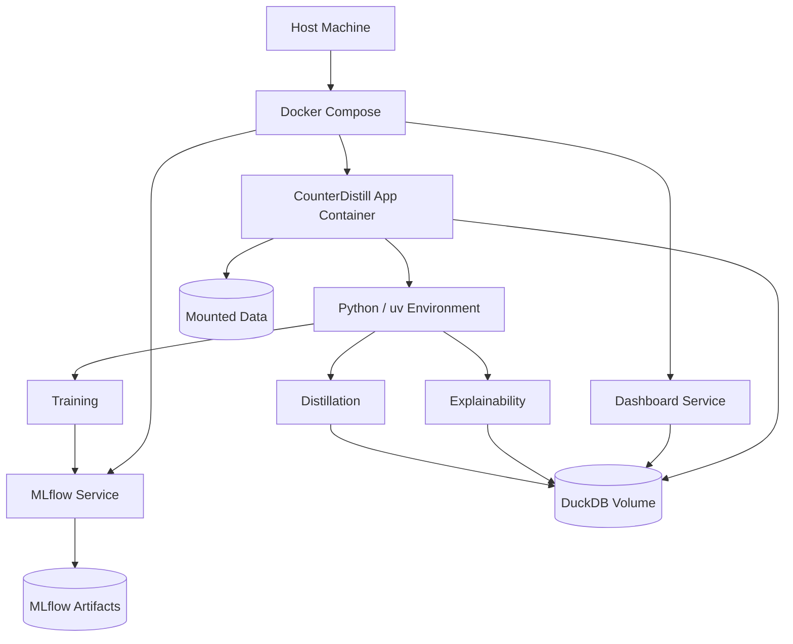

## Recommended Dockerfile

The repository can use a single project image for training, explainability, distillation, testing, and dashboard commands.

```dockerfile
FROM python:3.12-slim

WORKDIR /app

COPY --from=ghcr.io/astral-sh/uv:latest /uv /uvx /bin/

COPY pyproject.toml uv.lock ./

RUN uv sync --frozen --no-dev

COPY . .

ENV PATH="/app/.venv/bin:$PATH"

CMD ["python", "-m", "src.modeling.train"]
```

For development, install the dev dependency group:

```dockerfile
RUN uv sync --frozen
```

## Recommended `.dockerignore`

```text
.git
.github
.venv
__pycache__
*.pyc

data/raw
database
mlruns
outputs

.pytest_cache
.mypy_cache
.ruff_cache
htmlcov
.coverage
```

## Recommended Docker Compose

A useful Compose setup separates the project runtime from experiment tracking.

```yaml
services:
  counterdistill:
    build: .
    working_dir: /app
    volumes:
      - ./data:/app/data
      - ./database:/app/database
      - ./outputs:/app/outputs
    environment:
      - PYTHONUNBUFFERED=1

  mlflow:
    build: .
    command:
      - mlflow
      - server
      - --host
      - 0.0.0.0
      - --port
      - "5000"
      - --backend-store-uri
      - sqlite:////app/database/mlflow.db
      - --default-artifact-root
      - /app/mlartifacts
    ports:
      - "5000:5000"
    volumes:
      - ./database:/app/database
      - ./mlartifacts:/app/mlartifacts

  dashboard:
    build: .
    command:
      - streamlit
      - run
      - src/dashboard/app.py
      - --server.address=0.0.0.0
    ports:
      - "8501:8501"
    volumes:
      - ./database:/app/database
      - ./outputs:/app/outputs
```

> The Docker and Compose snippets above describe the intended containerized project setup. Adjust the dashboard path and MLflow configuration as those components evolve.

---

# Running with Docker

## Build the image

```bash
docker build -t counterdistill .
```

## Train a model

```bash
docker run --rm \
  -v "$(pwd)/data:/app/data" \
  -v "$(pwd)/database:/app/database" \
  counterdistill \
  python -m src.modeling.train model=random_forest
```

On PowerShell:

```powershell
docker run --rm `
  -v "${PWD}/data:/app/data" `
  -v "${PWD}/database:/app/database" `
  counterdistill `
  python -m src.modeling.train model=random_forest
```

## Generate explanations

```bash
docker run --rm \
  -v "$(pwd)/data:/app/data" \
  -v "$(pwd)/database:/app/database" \
  counterdistill \
  python -m src.explainability.explain model=random_forest
```

## Start services with Compose

```bash
docker compose up --build
```

MLflow:

```text
http://localhost:5000
```

Streamlit dashboard:

```text
http://localhost:8501
```

---

# Local Development

## Requirements

* Python 3.12+
* uv
* Git
* Docker / Docker Compose optional

Clone the repository:

```bash
git clone https://github.com/rodrick-mpofu/counterdistill.git
cd counterdistill
```

Install dependencies:

```bash
uv sync --dev
```

Activate the environment if desired.

### macOS / Linux

```bash
source .venv/bin/activate
```

### Windows PowerShell

```powershell
.venv\Scripts\Activate.ps1
```

### Git Bash

```bash
source .venv/Scripts/activate
```

---

# Quick Start

## 1. Prepare the Adult Income dataset

The loader automatically downloads the UCI Adult dataset when the raw file is missing.

You can trigger preprocessing through the training workflow.

## 2. Train a model

```bash
uv run python -m src.modeling.train model=random_forest
```

## 3. Generate DiCE + SHAP explanations

```bash
uv run python -m src.explainability.explain model=random_forest
```

Without an MLflow `run_id`, the explanation workflow trains a compatible local model.

With a configured run ID, the pipeline can load the corresponding tracked model.

## 4. Inspect the DuckDB database

Using the DuckDB CLI:

```bash
duckdb database/counterdistill.db
```

Example queries:

```sql
SELECT COUNT(*)
FROM counterfactuals;
```

```sql
SELECT *
FROM counterfactuals
LIMIT 5;
```

```sql
SELECT feature_name, AVG(ABS(shap_value)) AS mean_abs_shap
FROM shap_values
GROUP BY feature_name
ORDER BY mean_abs_shap DESC
LIMIT 20;
```

---

# Project Structure

```text
counterdistill/
│
├── configs/
│   ├── config.yaml
│   ├── data/
│   ├── feature_engineering/
│   ├── model/
│   ├── clustering/
│   ├── mlflow/
│   └── optuna/
│
├── data/
│   ├── raw/
│   └── processed/
│
├── database/
│   └── counterdistill.db
│
├── src/
│   ├── ingestion/
│   │   └── data_loader.py
│   │
│   ├── features/
│   │   └── feature_engineering.py
│   │
│   ├── modeling/
│   │   └── train.py
│   │
│   ├── explainability/
│   │   ├── dice.py
│   │   ├── shap.py
│   │   └── explain.py
│   │
│   ├── storage/
│   │   └── duckdb.py
│   │
│   ├── clustering/
│   │   └── ...
│   │
│   ├── distillation/
│   │   └── ...
│   │
│   └── dashboard/
│       └── ...
│
├── tests/
│
├── Dockerfile
├── docker-compose.yml
├── pyproject.toml
├── uv.lock
└── README.md
```

Some later-stage directories shown above represent the intended project architecture and may be added as the distillation and dashboard phases are implemented.

---

# Technology Stack

| Area                 | Technology                      |
| -------------------- | ------------------------------- |
| Language             | Python                          |
| DataFrames           | Polars, pandas                  |
| ML                   | scikit-learn, XGBoost, LightGBM |
| Explainability       | DiCE, SHAP                      |
| Configuration        | Hydra, OmegaConf                |
| Optimization         | Optuna                          |
| Experiment Tracking  | MLflow                          |
| Analytical Storage   | DuckDB                          |
| Package Management   | uv                              |
| Visualization        | Matplotlib, Plotly              |
| Dashboard            | Streamlit                       |
| Containers           | Docker, Docker Compose          |
| Testing              | pytest                          |
| Linting / Formatting | Ruff, Black                     |
| Type Checking        | mypy                            |

---

# Current Pipeline Status

| Component                           | Status                |
| ----------------------------------- | --------------------- |
| Adult dataset ingestion             | Implemented           |
| Polars preprocessing                | Implemented           |
| Train-only feature fitting          | Implemented           |
| One-hot schema alignment            | Implemented           |
| Random Forest training              | Implemented           |
| MLflow experiment tracking          | Implemented           |
| DiCE model adapter                  | Implemented           |
| Raw-space counterfactual generation | Implemented           |
| SHAP explanations                   | Implemented           |
| DuckDB persistence                  | Implemented           |
| Counterfactual clustering           | In progress / planned |
| Global rule distillation            | Planned               |
| Streamlit dashboard                 | Planned               |
| Full Docker Compose workflow        | Planned               |

---

# Design Principles

### 1. Explanations should remain interpretable

Counterfactuals are represented in the original semantic feature space rather than the model's one-hot feature vector.

### 2. Preprocessing should not leak test information

Feature schemas and scaling statistics are learned from training data only.

### 3. Experiments should be reproducible

Hydra, MLflow, fixed seeds, `uv.lock`, and Docker provide reproducible configuration and environments.

### 4. Explanation artifacts should be queryable

DuckDB makes it possible to analyze thousands of counterfactual and SHAP records using SQL.

### 5. Local explanations should lead to global insight

The project does not stop at generating explanations. Its central goal is to aggregate, cluster, and distill them.

---

# Example Research Questions

CounterDistill can be used to explore questions such as:

* Which features are most frequently changed across valid counterfactuals?
* Which feature transitions most often flip a model prediction?
* Do groups of observations share similar counterfactual paths?
* How do SHAP importance patterns compare with counterfactual change patterns?
* Can counterfactual clusters be summarized as decision rules?
* How faithfully can a small interpretable model represent the behavior encoded in thousands of local explanations?
* Do different black-box models produce similar counterfactual archetypes?

---

# Roadmap

## Phase 1 — ML Engineering Foundation

* [x] Adult Income ingestion
* [x] Polars feature engineering
* [x] Hydra configuration
* [x] sklearn-compatible model training
* [x] MLflow tracking
* [x] DuckDB storage
* [x] uv environment management

## Phase 2 — Local Explainability

* [x] SHAP explanations
* [x] DiCE integration
* [x] raw-space counterfactual generation
* [x] feature-engineering model adapter
* [x] explanation persistence
* [x] run-level provenance

## Phase 3 — Counterfactual Aggregation

* [ ] encode counterfactual deltas
* [ ] construct feature-transition representations
* [ ] normalize numeric changes
* [ ] define counterfactual similarity metrics
* [ ] cluster explanation vectors
* [ ] evaluate cluster stability

## Phase 4 — Distillation

* [ ] summarize cluster archetypes
* [ ] extract interpretable rules
* [ ] train global surrogate models
* [ ] measure surrogate fidelity
* [ ] compare distilled rules with SHAP importance

## Phase 5 — Visualization

* [ ] Streamlit dashboard
* [ ] model/run selector
* [ ] SHAP feature importance views
* [ ] counterfactual explorer
* [ ] cluster visualization
* [ ] global rule explorer

## Phase 6 — Deployment

* [ ] production Dockerfile
* [ ] Docker Compose environment
* [ ] MLflow service
* [ ] persistent artifact volumes
* [ ] CI/CD validation
* [ ] reproducible end-to-end demo

---

# Testing and Code Quality

Run tests:

```bash
uv run pytest
```

Run Ruff:

```bash
uv run ruff check .
```

Format:

```bash
uv run ruff format .
```

Type checking:

```bash
uv run mypy src
```

If pre-commit is installed:

```bash
uv run pre-commit run --all-files
```

---

# Reproducibility

The project uses several layers of reproducibility:

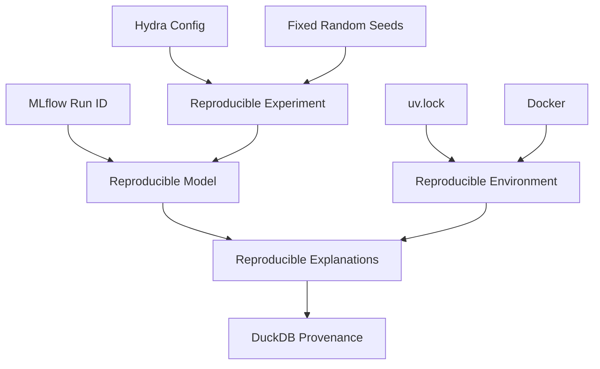

---

# Dataset

The initial benchmark uses the **UCI Adult Income dataset**.

The task is binary classification:

```text
income <= $50K
income > $50K
```

The dataset contains demographic and employment-related features such as:

* age
* education
* occupation
* workclass
* marital status
* relationship
* capital gain/loss
* hours worked per week
* native country

The dataset is used as a practical benchmark for developing the counterfactual-distillation pipeline; the architecture is intended to support additional tabular classification datasets later.

---

# Limitations and Responsible Interpretation

Counterfactual explanations describe the behavior of the **model**, not necessarily causal relationships in the real world.

For example:

```text
education -> higher predicted income
```

does not mean that changing one field in isolation will causally produce a particular real-world outcome.

Additional considerations include:

* immutable or sensitive attributes should generally be excluded from actionable counterfactual changes
* counterfactual feasibility should be evaluated explicitly
* model bias can propagate into explanations
* SHAP values describe model attribution, not causality
* global distilled rules approximate the source model and should be evaluated for fidelity

Future versions of CounterDistill will explicitly constrain immutable features such as race and sex during counterfactual generation.

---

# Contributing

This project is currently being developed as an ML engineering / explainable AI portfolio and research project.

Issues, suggestions, and experiments around:

* counterfactual explanations
* explainable AI
* interpretable model distillation
* explanation clustering
* ML reproducibility

are welcome.

---

# Author

**Rodrick Mpofu**

GitHub: [@rodrick-mpofu](https://github.com/rodrick-mpofu)

---

# License

Add the repository's chosen open-source license here once finalized.

# Launch dashboard
make dashboard
